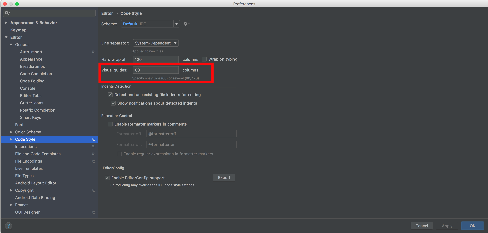

# Table of Contents

<!-- toc -->

- [1. Formatting](#1-formatting)
  * [1.1 - Line Length](#11---line-length)
  * [1.2 - Whitespace](#12---whitespace)
    + [1.2.1 - Indentation](#121---indentation)
    + [1.2.2 - Trailing Newlines](#122---trailing-newlines)
    + [1.2.3 Line Breaks](#123-line-breaks)
- [2. Naming](#2-naming)
  * [2.1 - Meaningful Variable & Function Names](#21---meaningful-variable--function-names)
- [3. Braces](#3-braces)
- [10. Git](#10-git)
  * [10.1 - Branch Names](#101---branch-names)
  * [10.2 - Commits](#102---commits)
  * [10.3 - Pull Requests](#103---pull-requests)

<!-- tocstop -->

### 1. Formatting

#### 1.1 - Line Length
Maximum line length should be 80 characters or less. You may make exceptions if
the code cannot be logically broken at 80 characters, but strive for 80.

Your IDE most likely has settings to enforce line length guides.

* IntelliJ



#### 1.2 - Whitespace

##### 1.2.1 - Indentation
Indent with 4 spaces instead of tabs, unless the language has a different 
standard for indentation.

##### 1.2.2 - Trailing Newlines
End files with an empty newline character.

##### 1.2.3 Line Breaks
Use Unix-style linebreaks ('\n'), not Windows-style ('\r\n').

### 2. Naming

#### 2.1 - Meaningful Variable & Function Names
Try to make your variable names as descriptive as possible. Avoid single letter 
or unclearly abbreviated variable names that don't offer much in the way of 
description of what they actually stand for. 

**Bad**
```python
# Python

def kg():
    x = 185
    y = x * 2.2
    
    print(f'Your weight in kilograms is {y}')
```

**Good**
```python
# Python

def print_pounds_to_kg():
    pounds = 185
    kilograms = pounds * 2.2
    
    print(f'Your weight in kilograms is {kilograms}')
```

### 3. Braces
Opening braces should be on the same line as the statement. Closing braces
should be on a new line.

**Bad**
```typescript
// TypeScript

function foo()
{
  let bar: number = 15;
}
```

**Good**
```typescript
// TypeScript

function foo() {
  let bar: number = 15;
}
```

### 10. Git

#### 10.1 - Branch Names
Branches should be named based upon the story or task being worked 
on, and be prefixed with the task number.

**Example:**

Task: DMSG-5309 Create Golang Style Guide

**Bad**

`golang-guide`

**Good**

`DMSG-5309-golang-style-guide`

#### 10.2 - Commits

- [ ] TODO: an example of a good commit

#### 10.3 - Pull Requests
Pull Requests should have the story or task name in the title, in addition to
the task number. Additional description in the title is allowed, but in many
cases the task name and number is sufficient.

- [ ] TODO: What should go in the pull request body?

**Example:**

Task: DMSG-5309 Create Golang Style Guide

**Bad**

`make go style guide`

**Good**

`DMSG-5309 Create Golang Style Guide`

